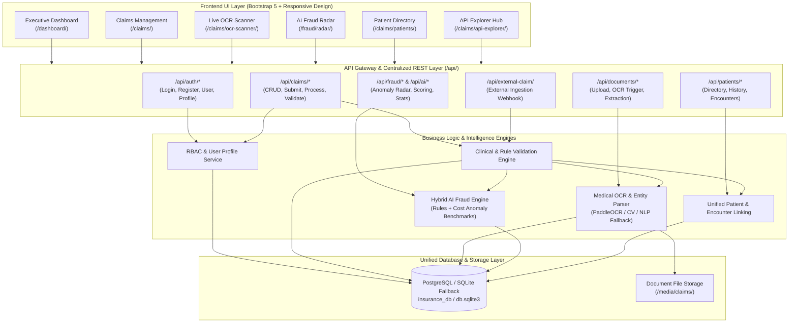
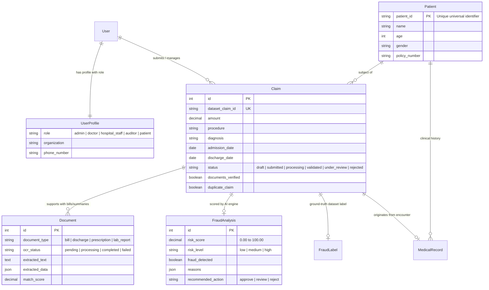
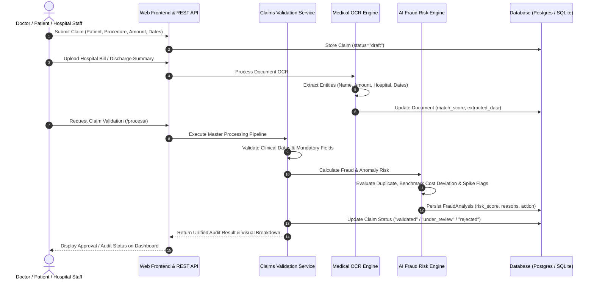

# HealthGuard PEC - Master Project Integration Documentation

**PEC Hackathon Healthcare Platform**  
**Unified Production Architecture & Module Integration Specification**

---

## 1. Overall System Architecture

The platform integrates independently developed modules—**Centralized Authentication & RBAC**, **Healthcare Claims Management**, **Multi-Tier OCR Document Intelligence**, **AI/ML Fraud Detection Engine**, and **Unified Patient Clinical Records**—into one seamless, production-ready healthcare application.

### High-Level Architecture Diagram



---

## 2. Integrated Module Catalog

| Module | Core Responsibility | Key Services / Files | Interface / Route |
| :--- | :--- | :--- | :--- |
| **Authentication & RBAC** | Centralized session & REST API login, user registration, and role-based permissions (Admin, Doctor, Hospital Staff, Auditor, Patient). | `authentication/models.py`<br>`authentication/views.py`<br>`authentication/serializers.py` | `/login/`<br>`/register/`<br>`/api/auth/login/`<br>`/api/auth/register/` |
| **Claims Management** | Claim lifecycle handling (Draft → Submitted → Processing → Validated / Under Review / Rejected), hospital intake, amount calculation. | `claims/models.py`<br>`claims/views.py`<br>`claims/services.py`<br>`claims/forms.py` | `/claims/`<br>`/claims/<id>/`<br>`/api/claims/`<br>`/api/claims/<id>/process/` |
| **OCR Document Intelligence** | Scans bills, prescriptions, discharge summaries. Extracts structured clinical entities (Patient, Hospital, Doctor, Bill Amount, Dates) and computes match scores against claims. | `claims/ocr_service.py`<br>`OCR/PaddleOCR/`<br>`claims/models.py` | `/claims/ocr-scanner/`<br>`/claims/<id>/upload/`<br>`/api/documents/<id>/ocr/` |
| **AI Fraud Detection** | Hybrid engine combining deterministic rules (duplicate claims, diagnosis mismatches, high frequency) with statistical procedure cost anomaly detection. | `fraud_detection/models.py`<br>`fraud_detection/services.py`<br>`fraud_detection/views.py` | `/fraud/radar/`<br>`/api/fraud/analyze/`<br>`/api/ai/analyze/`<br>`/api/fraud/stats/` |
| **Common Patient Data Model** | Unifies patient identities (`patient_id`), clinical history, admission/discharge encounters, and medical records across claims. | `claims/models.py`<br>`claims/services.py` | `/claims/patients/`<br>`/api/patients/`<br>`/api/patients/<id>/records/` |
| **External Ingestion Webhook** | Backward-compatible API for third-party hospital systems to ingest claims directly into the platform repository. | `claims/ingestion.py`<br>`claims/views.py` | `POST /api/external-claim/` |

---

## 3. Unified REST API Contracts

All REST APIs return a standardized JSON envelope:

```json
{
  "success": true,
  "message": "Human-readable description",
  "code": "STATUS_CODE_ENUM",
  "data": { ... },
  "error": null
}
```

### Primary Endpoints

#### 1. Authentication Login
* **Endpoint:** `POST /api/auth/login/`
* **Request:**
  ```json
  {
    "username": "doctor_user",
    "password": "SecurePassword123"
  }
  ```
* **Response (200 OK):**
  ```json
  {
    "success": true,
    "message": "Login successful",
    "code": "AUTH_SUCCESS",
    "data": {
      "user": {
        "id": 1,
        "username": "doctor_user",
        "email": "doctor@hospital.org",
        "profile": {
          "role": "doctor",
          "role_display": "Doctor / Medical Officer",
          "organization": "Apollo Hospital"
        }
      },
      "session_id": "9x7...abc"
    }
  }
  ```

#### 2. Claim Submission & Processing Pipeline
* **Endpoint:** `POST /api/claims/<claim_id>/process/`
* **Description:** Runs OCR reconciliation, clinical validation, and AI fraud detection in one atomic transaction.
* **Response (200 OK):**
  ```json
  {
    "success": true,
    "message": "Claim #1 processed successfully",
    "status": "validated",
    "validation": {
      "is_valid": true,
      "conditions": [
        { "name": "Valid claim amount", "passed": true, "message": "Claim amount ₹65,000.00 is valid." },
        { "name": "Required information", "passed": true, "message": "Required patient, provider, and procedure information is present." },
        { "name": "Diagnosis-Procedure Match", "passed": true, "message": "Procedure 'Appendectomy' is clinically compatible with diagnosis 'Appendicitis'." }
      ]
    },
    "fraud_analysis": {
      "risk_score": 15.00,
      "risk_level": "low",
      "fraud_detected": false,
      "reasons": [],
      "recommended_action": "approve"
    }
  }
  ```

#### 3. Standalone AI Fraud Anomaly Analyzer
* **Endpoint:** `POST /api/fraud/analyze/` (or `POST /api/ai/analyze/`)
* **Request (Raw Payload or Claim ID):**
  ```json
  {
    "patient_name": "Vikram Seth",
    "hospital_name": "Fortis Hospital",
    "procedure": "Heart Surgery",
    "amount": 320000.00,
    "previous_claims": 8,
    "duplicate_claim": false,
    "diagnosis_procedure_match": true,
    "documents_verified": false
  }
  ```
* **Response (200 OK):**
  ```json
  {
    "success": true,
    "message": "AI Fraud Risk Analysis completed",
    "code": "ANALYSIS_COMPLETE",
    "data": {
      "risk_score": 85.00,
      "risk_level": "high",
      "fraud_detected": true,
      "reasons": [
        "Amount (₹320,000) significantly exceeds typical benchmark (₹150,000) for Heart Surgery",
        "Extremely high claim amount exceeding ₹3,00,000 threshold",
        "Excessive previous claims history (8 claims)",
        "Supporting documents have not completed digital verification"
      ],
      "ml_confidence": 0.89,
      "recommended_action": "reject"
    }
  }
  ```

#### 4. Document OCR Trigger & Extracted Entities
* **Endpoint:** `POST /api/documents/<document_id>/ocr/`
* **Response (200 OK):**
  ```json
  {
    "success": true,
    "document_id": 12,
    "ocr_status": "completed",
    "match_score": 95.0,
    "extracted_data": {
      "patient_name": "Meera Iyer",
      "hospital_name": "MIOT International",
      "total_amount": 63868.99,
      "admission_date": "2026-01-07",
      "discharge_date": "2026-01-12",
      "procedure": "Cataract Surgery"
    }
  }
  ```

---

## 4. Unified Data Model & Entity Relationships



---

## 5. End-to-End Processing Workflow



---

## 6. Environment Configuration

Copy `.env.example` to `.env` to customize settings:

```ini
# Core Django Settings
DEBUG=True
SECRET_KEY=pec-hackathon-unified-healthcare-platform-secret-key-2026
ALLOWED_HOSTS=localhost,127.0.0.1,0.0.0.0

# Database Configuration (PostgreSQL by default with seamless SQLite fallback)
DB_ENGINE=django.db.backends.postgresql
DB_NAME=insurance_db
DB_USER=postgres
DB_PASSWORD=Priyan@12345
DB_HOST=localhost
DB_PORT=5432

# Set to True to force SQLite database (zero external dependencies)
USE_SQLITE=False

# OCR Configuration
OCR_ENGINE=auto
OCR_CONFIDENCE_THRESHOLD=0.75

# AI & Fraud Detection Settings
FRAUD_RISK_HIGH_THRESHOLD=60.0
FRAUD_RISK_MEDIUM_THRESHOLD=30.0
AI_MODEL_ANOMALY_DETECTION=True
```

---

## 7. How to Run the Complete Platform

### Prerequisites
* Python 3.10+ (Active virtual environment in `./venv`)

### Quick Start (Standard Mode - PostgreSQL or SQLite)

1. **Activate Virtual Environment:**
   * **Windows PowerShell:**
     ```powershell
     .\venv\Scripts\Activate.ps1
     ```
   * **Linux / macOS:**
     ```bash
     source venv/bin/activate
     ```

2. **Apply Database Migrations:**
   ```powershell
   python manage.py migrate
   ```

3. **Synchronize Unified Platform Data:**
   *(Links Patient entities, encounters, and calculates initial AI fraud scores)*
   ```powershell
   python manage.py sync_platform_data
   ```

4. **Run the Development Server:**
   ```powershell
   python manage.py runserver 8000
   ```

5. **Access Web Interfaces:**
   * **Main Dashboard:** [http://127.0.0.1:8000/](http://127.0.0.1:8000/)
   * **Claims Management:** [http://127.0.0.1:8000/claims/](http://127.0.0.1:8000/claims/)
   * **AI Fraud Radar:** [http://127.0.0.1:8000/fraud/radar/](http://127.0.0.1:8000/fraud/radar/)
   * **Document OCR Scanner:** [http://127.0.0.1:8000/claims/ocr-scanner/](http://127.0.0.1:8000/claims/ocr-scanner/)
   * **Patient Directory:** [http://127.0.0.1:8000/claims/patients/](http://127.0.0.1:8000/claims/patients/)
   * **Interactive REST API Hub:** [http://127.0.0.1:8000/claims/api-explorer/](http://127.0.0.1:8000/claims/api-explorer/)
   * **Django Admin:** [http://127.0.0.1:8000/admin/](http://127.0.0.1:8000/admin/)

---

## 8. Running Automated Tests

Run the full integrated test suite across all modules (Authentication, Claims, OCR, and AI Fraud Detection):

```powershell
python manage.py test
```

To run with SQLite fallback explicitly:
```powershell
$env:USE_SQLITE="True"; python manage.py test; Remove-Item Env:\USE_SQLITE
```

---

## 9. Conflicts Resolved During Integration

1. **Database Portability Conflict:**
   * *Problem:* Previously, settings hardcoded PostgreSQL credentials without fallback, preventing execution on machines without active PostgreSQL instances.
   * *Resolution:* Implemented dynamic environment loading with seamless SQLite `db.sqlite3` fallback.
2. **User Identity & Role Disconnect:**
   * *Problem:* Standard Django `User` model had no role taxonomy (Admin, Doctor, Auditor, Patient).
   * *Resolution:* Created `UserProfile` with automated signals and role-based interface views.
3. **Disparate Patient Identifiers:**
   * *Problem:* Claims stored raw strings for patients without a persistent clinical entity.
   * *Resolution:* Introduced a unified `Patient` model with consistent `patient_id` mapping and medical encounter tracking.
4. **Isolated OCR & Fraud Logic:**
   * *Problem:* OCR and Fraud detection were disconnected standalone scripts.
   * *Resolution:* Built unified service pipelines (`ocr_service.py` and `services.py`) that trigger OCR on upload, cross-verify entity match scores, and feed directly into the AI fraud assessment and claim approval status.

---

## 10. Future Improvements
* Integration of deep-learning based Vision Transformers (Donut / LayoutLMv3) for arbitrary multi-language handwritten prescription parsing.
* Real-time WebSocket notifications for hospital claims status transitions.
* Integration with Ayushman Bharat Digital Mission (ABDM) / FHIR standard healthcare exchange protocols.
